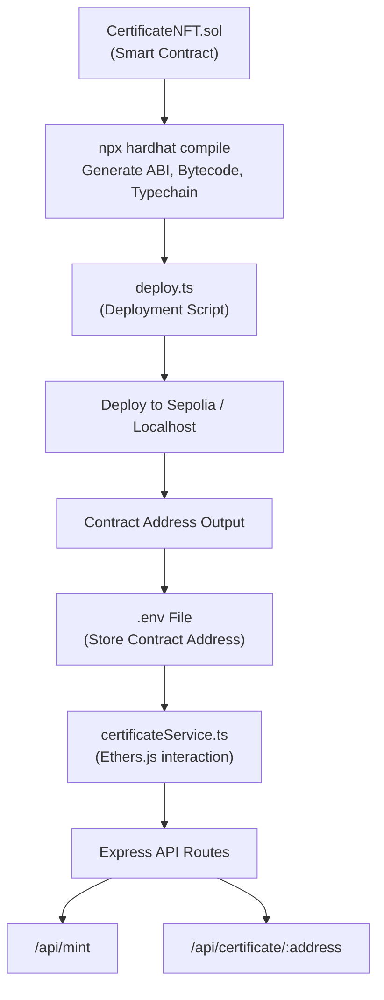

# 🚀 Certify-NFT Project Workflow

```mermaid
graph TD

A["CertificateNFT.sol\n(Smart Contract)"] --> B["npx hardhat compile\nGenerate ABI, Bytecode, Typechain"]
B --> C["deploy.ts\n(Deployment Script)"]
C --> D["Deploy to Sepolia / Localhost"]
D --> E["Contract Address Output"]
E --> F[".env File\n(Store Contract Address)"]

F --> G["certificateService.ts\n(Ethers.js interaction)"]
G --> H["Express API Routes"]
H --> H1["/api/mint"]
H --> H2["/api/certificate/:address"]
```